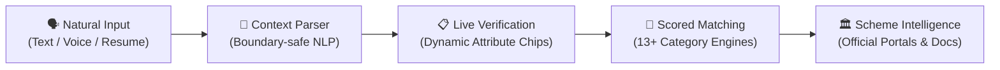

# 🇮🇳 SchemeFinder (`योजना खोज`)
### *Zero-Friction Civic Intelligence Engine for India's Welfare Ecosystem*

[](https://opensource.org/licenses/MIT)
[](https://vitejs.org/)
[](https://reactjs.org/)
[](https://tailwindcss.com/)
[](#-bilingual-first-design)

---

## 💡 Why SchemeFinder Exists

Over **₹1.5 Lakh Crore** in central and state welfare benefits go unclaimed annually—not due to lack of intent, but due to the **Civic Discovery Chasm**:

1. **Complex Government Portals**: Scattered across 50+ ministries, thousands of notifications, and complex PDF guidelines.
2. **Exhaustive Bureaucratic Forms**: Users are forced to fill 25+ mandatory inputs before seeing if they qualify.
3. **Linguistic & Digital Barriers**: Most platforms require strict bureaucratic terminology that ordinary citizens don't use in daily speech.

**SchemeFinder** reimagines citizen engagement. Instead of navigating endless menus, citizens describe their story in plain conversational text or voice—in **English or Hindi**—and our rule-governed NLP engine extracts criteria to present instant, verified schemes.

---

## ⚡ The Discovery Pipeline



1. **Natural Input (`Describe Yourself`)**:
   Citizens talk or type freely: *"I'm a 21-year-old student from Jaipur studying engineering with 3L family income."*
2. **Context-Aware Entity Extraction**:
   Custom boundary-safe regex NLP extracts age, location, occupation, caste category, and income while avoiding false positives.
3. **Interactive Verification (`Verification Step`)**:
   Extracted data appears as interactive chips that users can edit, delete, or append on the fly with instant visual state reflection.
4. **Weighted Scheme Matcher**:
   Cross-references citizen criteria against official Central & State schemes with precise multi-criteria scoring.

---

## 🌟 Distinct Architectural Highlights

### 🎙️ 4 Modes of Citizen Ingestion
- **Freeform Narrative**: Tell your story naturally without restrictive form constraints.
- **Micro-Form**: For users who prefer direct fields.
- **Voice Recognition**: Web Speech API integration in both English and Hindi.
- **Resume / Bio Upload**: Structured document extraction for job seekers and students.

### 🧩 3-Stage Synchronous Visual Journey
- **Step 1: Input Profile** — Live state feedback as input is captured.
- **Step 2: Verification (Extracted Details)** — Dynamic badge transitions; automatically clears validation ticks when attributes are removed.
- **Step 3: Matching Schemes** — Seamless carry-over to the Results engine with verified criteria badges.

### 🎨 Precision 4-Tone Design System
Built on a dignified civic color system optimized for high contrast, accessibility, and public trust:
| Color Tone | Hex | Role |
| :--- | :--- | :--- |
| **Deep Forest Green** | `#174D38` | Primary Brand, Action CTAs & Verification Badges |
| **Rich Earth Brown** | `#4D1717` | Accent & Secondary Structural Highlights |
| **Off-White Canvas** | `#F2F2F2` | Gentle, Non-Fatiguing Neutral Background |
| **Cool Silver Border** | `#CBCBCB` | Crisp Card Delimiters & Form Outlines |

### 🌐 Bilingual-First Engine
Full English and Hindi (`हिन्दी`) localization covering:
- UI labels, navigation, and modal dialogues
- Scheme descriptions, benefits, and required document lists
- Native Hindi numeral and state-district entity recognition

---

## 🗂️ Project Anatomy

```text
schemefinder/
├── src/
│   ├── components/
│   │   ├── DiscoveryStepper.jsx       # Synchronous 3-stage progress engine
│   │   ├── LiveExtractionSimulator.jsx # Real-time AI extraction demonstration
│   │   ├── ProfileChips.jsx           # Reactive verified attribute tags
│   │   ├── SchemeCard.jsx             # Official scheme presentation card
│   │   └── FilterBar.jsx              # Category & Ministry facet filter
│   ├── context/
│   │   ├── LanguageContext.jsx        # Dual-language i18n state (EN/HI)
│   │   └── ProfileContext.jsx         # Citizen session profile store
│   ├── data/
│   │   ├── schemes.js                 # Curated central & state scheme dataset
│   │   └── sampleProfiles.js          # 1-click citizen archetype presets
│   ├── pages/
│   │   ├── Home.jsx                   # Hero landing, simulator & category strip
│   │   ├── FindSchemes.jsx            # Multi-modal input & verification hub
│   │   ├── Results.jsx                # Ranked scheme output with filters
│   │   └── SchemeDetail.jsx           # Application process, docs & official URLs
│   └── utils/
│       ├── profileParser.js           # Boundary-safe regex NLP extractor
│       └── schemeMatcher.js           # Multi-attribute scoring engine
├── server/                            # Optional Express API backend
└── vite.config.js                     # Vite build configuration
```

---

## 🚀 Quickstart Guide

### Prerequisites
- Node.js (v18.0 or higher)
- npm / yarn / pnpm

### Installation

```bash
# 1. Clone the repository
git clone https://github.com/your-username/schemefinder.git

# 2. Enter directory
cd schemefinder

# 3. Install dependencies
npm install

# 4. Start local development server
npm run dev
```

Navigate to `http://localhost:5173` (or `http://localhost:5174`) in your browser.

### Production Build

```bash
# Compile and optimize for production
npm run build

# Preview production build locally
npm run preview
```

---

## 🛡️ Privacy & Citizen Trust

- **Zero Data Mining**: User profiles are processed in-memory for session matching.
- **Transparent Logic**: Every scheme card clearly states *why* it matched your specific criteria.
- **Direct Official Links**: Applications are redirected straight to verified `.gov.in` and `.nic.in` state portals—no intermediary fees or data collection.

---

## 🤝 Contributing

Contributions are welcome! Please open an issue to discuss proposed enhancements or submit a Pull Request.

```bash
git checkout -b feature/new-scheme-dataset
git commit -m "feat: add Rajasthan state education schemes"
git push origin feature/new-scheme-dataset
```

---

## 📄 License

This project is licensed under the [MIT License](LICENSE).